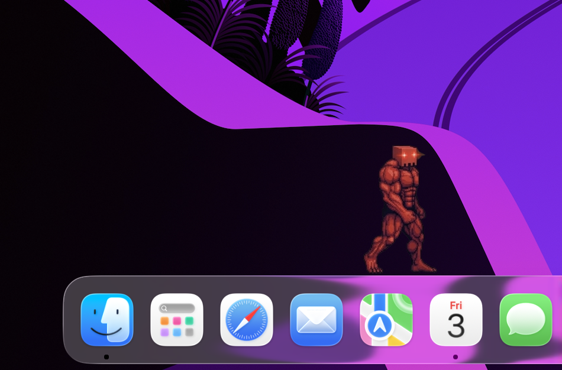

<div align="center">

# Vibe-Friend



**Tiny AI companions that live on your macOS dock while you vibe-code.**

If it makes your setup a little more alive, a ⭐ goes a long way!

One pet per running session — each with its own color.
They walk when your agent is busy, pause when it's waiting on you.
Go idle and they'll build a Minecraft-style world on your dock.
Customize size, monochrome mode, and idle build timer from the menu bar.

[](https://github.com/Matribuk/vibe-friend/actions/workflows/ci.yml)
[](../../releases/latest)
[](https://swift.org)
[](#license)
[](#install)

</div>

---

## Supported agents

| Claude Code | Gemini CLI | Codex | Aider | Goose | OpenCode | Cline | Claw |
|:-----------:|:----------:|:-----:|:-----:|:-----:|:--------:|:-----:|:----:|
| ✓ | ✓ | ✓ | ✓ | ✓ | ✓ | ✓ | ✓ |

---

## Installation

### Download — recommended

Grab the latest [`VibeFriend.zip`](../../releases/latest), unzip, drag to `/Applications`.

Notarized by Apple — opens without any Gatekeeper warning.

### Build from source

```bash
git clone https://github.com/matribuk/vibe-friend
cd vibe-friend
./build_app.sh
open VibeFriend.app

# Optional: move to Applications
mv VibeFriend.app /Applications/
```

> **First launch:** macOS will ask for Screen Recording permission — used only to detect your dock position and size. No screen content is ever captured or transmitted.

---

## Features

- **One pet per session** — spawn as many AI sessions as you want, each gets its own companion
- **Unique color per session** — golden-ratio hue spacing so they're always visually distinct
- **Walk ↔ think** — driven by TTY activity, the pet knows when your agent is actually working
- **Drag & drop** — pick them up, drop them anywhere, they fall back to the dock with gravity
- **Click-through** — transparent pixels pass clicks straight through to your apps below
- **Always visible** — works across all Spaces, fullscreen, and Mission Control
- **Any terminal** — Warp, iTerm, Terminal.app, or anything else
- **Monochrome mode** — toggle from the menu bar to switch all pets to grayscale, with luminance variance preserved per color
- **Adjustable size** — slider in the menu bar from 0.5× to 2×, persisted across restarts
- **Idle build mode** — go idle for a configurable time (5s → 30min, or off) and pets automatically build a procedural island world on your dock: water, sand beaches, dirt, stone, grass — all rendered with block SVGs and cel-shading borders. Pets walk to each block position and place it, ride boats over water, and adapt to dock vs fullscreen layout

---

## Requirements

- macOS 13 Ventura or later
- At least one [supported agent](#supported-agents) running in a terminal
- Swift 5.9+ / Xcode 15+ *(build from source only)*

---

## Privacy

Runs entirely on your Mac. No network calls, no telemetry, no accounts.

Watches process names via `ps` and TTY file activity to animate the pets — nothing else.

---

## Credits

- **Character & sprites** — original character by [sisyphus-dev-ai](https://github.com/sisyphus-dev-ai) and the [Claw Code team](https://github.com/ultraworkers/claw-code). Sprites generated with Gemini AI from their original asset. Their permission was not explicitly requested — if you'd like the asset changed or removed, please [open an issue](../../issues) or reach out directly.
- **Concept** — dock pet idea inspired by [lil-agents](https://github.com/ryanstephen/lil-agents) by Ryan Stephen.

> **Open to contributions** — new features, new agents, asset picker, custom sprites, bug fixes — PRs are very welcome. See [CONTRIBUTING.md](CONTRIBUTING.md).

---

## License

[MIT](LICENSE)
